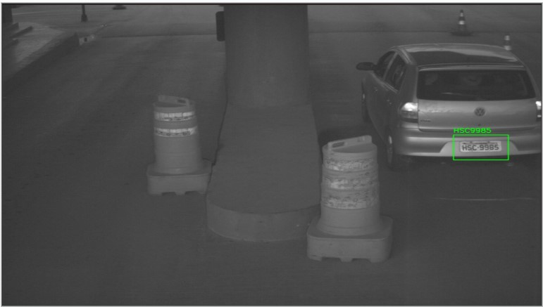
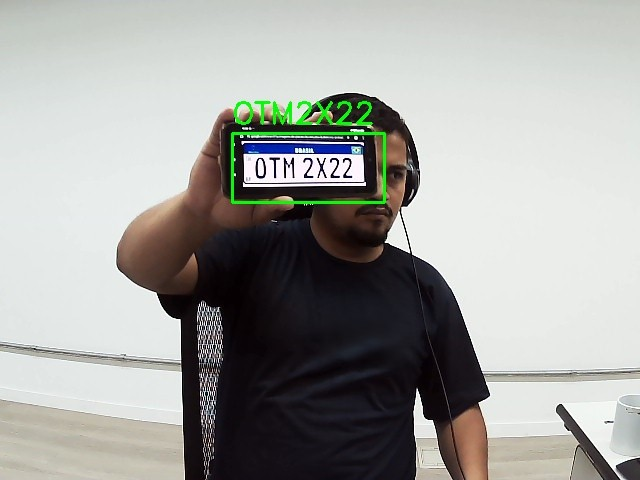
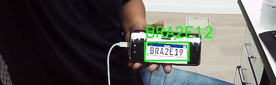
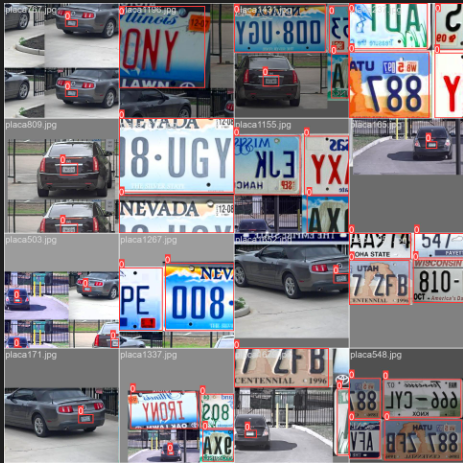
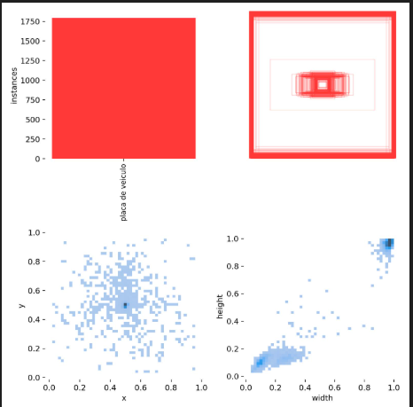
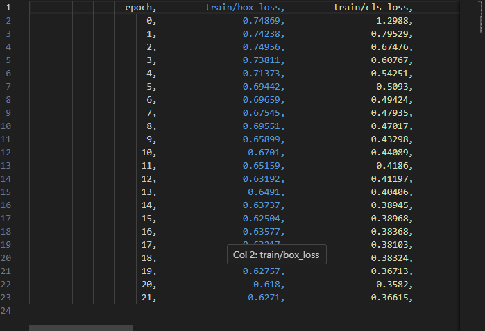

# 🚘 OCR-Phantera


**OCR-Phantera** é uma solução de **Reconhecimento Automático de Placas de Veículos (ALPR)** usando IA para detectar e ler placas em tempo real com alta precisão, suportando padrões **Mercosul** e **Antigo**.



---

## ✨ Funcionalidades

- ✅ **Detecção em Tempo Real** com YOLOv8
- ✅ **OCR com EasyOCR** (suporte a GPU via CUDA)
- ✅ **Pré-processamento avançado** (Filtros, CLAHE e binarização em `preprocess_image.py`)
- ✅ **Validação Dupla** via Regex (Placa Mercosul e Padrão Antigo)
- ✅ **Cache inteligente** para evitar leituras duplicadas
- ✅ **Registro em CSV**, com salvamento automático de frames e recortes

---

## 📸 Galeria de Resultados

Exemplos reais de detecção e leitura no padrões de placas Mercosul:

| Placa Mercosul | Placa Mercosul |
| :---: | :---: |
|  |  |

---

## 🚀 Tecnologias Utilizadas

- **Linguagem:** Python 3.12+
- **OCR:** EasyOCR
- **Detecção:** Ultralytics YOLOv8
- **Processamento de Imagem:** OpenCV
- **Matemática/Dados:** NumPy

---

## 📦 Instalação

### 1. Clonar o repositório

```bash
git clone [https://github.com/seu-usuario/OCR-Phantera.git](https://github.com/seu-usuario/OCR-Phantera.git)
cd OCR-Phantera
````

### 2\. Criar e ativar ambiente virtual

```bash
# Windows
python -m venv .venv
.\.venv\Scripts\activate

# Linux / macOS
python3 -m venv .venv
source .venv/bin/activate
```

### 3\. Instalar dependências

```bash
pip install -r requirements.txt
```

> 💡 **Para usar GPU**, verifique a instalação correta do PyTorch com suporte a CUDA.

-----

## ▶️ Execução

Certifique-se de que seu modelo treinado (`best.pt`) está em:

```
runs/detect/train/weights/best.pt
```

Execute:

```bash
python main.py
```

> Pressione `Q` na janela de visualização para encerrar.

-----

## 🏋️‍♂️ Treinamento e Análise

O treinamento foi feito com anotações manuais utilizando a ferramenta:

🔗 [VoTT - Visual Object Tagging Tool](https://github.com/microsoft/VoTT/releases)

### 📊 Performance do Modelo

Abaixo, as métricas de perda e precisão durante o treinamento do YOLOv8:

### 📂 Análise do Dataset

Detalhes sobre a distribuição das classes e amostras utilizadas:

| Amostra de Anotações | Analise das Anotações  | Resultado do treinamento 
| :---: | :---: |:---: |
|  |  |  |

### Comandos de Treino

Para converter novos datasets (VOC para YOLO) ou iniciar um novo treinamento:

```bash
# Conversão
python convert_voc_to_yolo.py

# Treinamento
python treinamento.py
```

-----

## 📂 Estrutura do Projeto

```
OCR-Phantera/
│
├── docs/                   # Documentação e imagens do README
├── placas-OCR/             # Dataset bruto e Resultados (CSV/Imagens salvos)
├── dataset/                # Dataset pronto para YOLO
├── runs/                   # Pesos do modelo treinado
│   └── detect/train/
├── .venv/                  # Ambiente virtual
├── main.py                 # Sistema principal (YOLO + EasyOCR)
├── ocr_easy.py             # OCR + Validação Regex
├── preprocess_image.py     # Pipeline de pré-processamento
├── preprocess_contours.py  # Detecção auxiliar por contornos
├── utils.py                # Funções auxiliares
├── treinamento.py          # Script de treino YOLOv8
├── TestedoReconhecimento.py# Teste isolado de OCR
├── convert_voc_to_yolo.py  # Conversor VOC -> YOLO
├── modificarnome.py        # Preparação de imagens
└── requirements.txt        # Dependências
```

-----

## 👨‍💻 Autor

Projeto desenvolvido por **Roberth Arnaldo Loogam Souza da Silva**

## 🤝 Contribuições

Contribuições são bem-vindas\!

  * Sugestões? Abra uma *issue*
  * Melhorias? Envie um *pull request*

